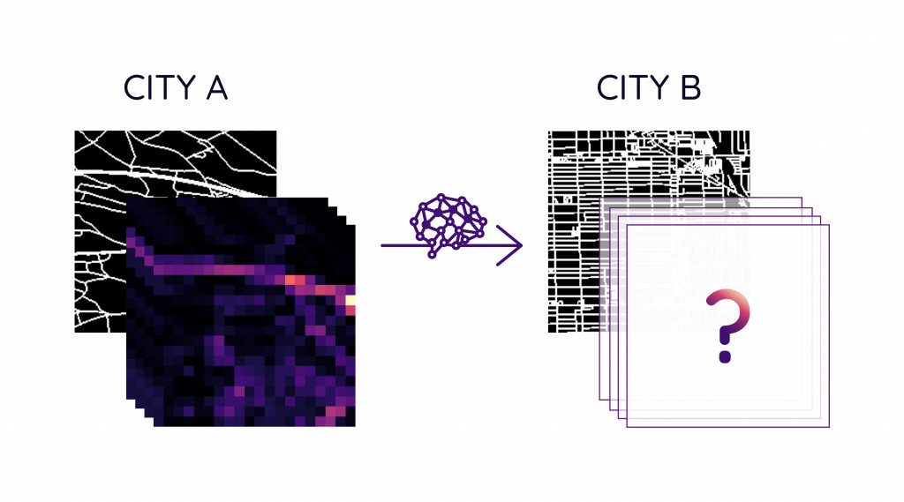
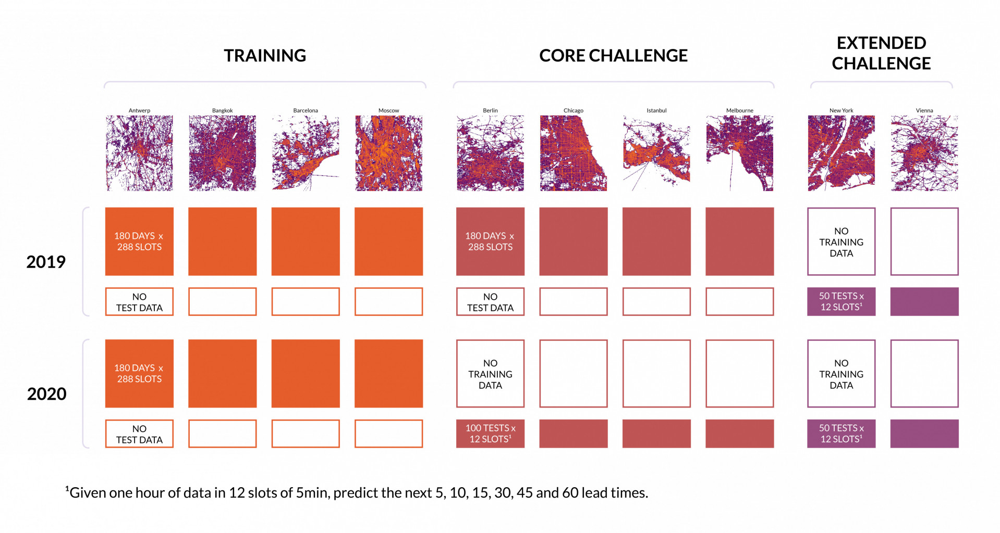

# Traffic4cast 2021 – Temporal and Spatial Few-Shot Transfer Learning in Traffic Map Movie Forecasting

- Study high-resolution 8-channel traffic movies of entire cities
- Overcome the temporal domain shift pre/post COVID-19
- Cover spatial domain shifts and predict traffic for unseen cities
- Incorporate road network information and detect patterns on graphs



[This repo](https://github.com/iarai/NeurIPS2021-traffic4cast) contains all information about the Traffic4cast 2021 NeurIPS competition for participants. It
contains detailed information about the competition and data as well as code.

## TLDR

After cloning this [repo](https://github.com/iarai/NeurIPS2021-traffic4cast.git),
download [data](https://www.iarai.ac.at/traffic4cast/forums/forum/competition/competition-2021/) and extract data to `data/raw` subfolder, run

```bash
git clone https://github.com/iarai/NeurIPS2021-traffic4cast
cd NeurIPS2021-traffic4cast

conda env update -f environment.yaml
conda activate t4c

export PYTHONPATH="$PYTHONPATH:$PWD"


DEVICE=cpu
DATA_RAW_PATH="./data/raw"
GROUND_TRUTH=""


# run one of the following:

# naive_average: take average of input frames as prediction for all prediction times
python baselines/baselines_cli.py --model_str=naive_average --limit=2 --epochs=1 --batch_size=1 --num_workers=1 --data_raw_path=$DATA_RAW_PATH --device=$DEVICE $GROUND_TRUTH
# a vanilla UNet:
python baselines/baselines_cli.py --model_str=unet          --limit=2 --epochs=1 --batch_size=1 --num_workers=1 --data_raw_path=$DATA_RAW_PATH --device=$DEVICE $GROUND_TRUTH

# a UNet with separate training for temporal cities and fine-tuning for spatiotemporal cities
python baselines/baselines_unet_separate.py --model_str=unet --limit=2 --epochs=1 --batch_size=1 --num_workers=1 --data_raw_path=$DATA_RAW_PATH  --device=$DEVICE $GROUND_TRUTH

# gcn: graph-based model
python baselines/baselines_cli.py --model_str=gcn           --limit=2 --epochs=1 --batch_size=1 --num_workers=1 --train_fraction=0.97 --val_fraction=0.03  --file_filter="**/*BERLIN*8ch.h5" --data_raw_path="/scratch/t4c21-data/raw" --device=$DEVICE $GROUND_TRUTH
```

This trains a vanilla U-Net / GCN on 1 training day of 1 city (240 samples) and creates a submission.

## Contents

[Traffic4cast 2021 – Temporal and Spatial Few-Shot Transfer Learning in Traffic Map Movie Forecasting](https://www.iarai.ac.at/traffic4cast):

- [Contents](#contents)
- [Introduction](#introduction)
- [Get the data](#get-the-data)
- [Getting started](#getting-started)
    - [Data](data/README.md)
    - [Metrics](metrics/README.md)
    - [Submission guide](util/README.md)
- [Explore with code](#explore-with-code)
- [Dev setup](#dev-setup)
- [Sitemap](#sitemap)
- [Cite](#cite)

## Introduction



Going beyond the challenges at NeurIPS 2019 and 2020, this year will explore models that adapt to domain shift both in space and time. Specifically, we will
provide dynamic traffic data for 4 different cities in the more effective format we introduced in Traffic4cast 2020. Half of this data will be from 2019, before
the COVID pandemic hit the world, and the other half will be from 2020 when the pandemic started affecting all our lives. We will complement these dynamic data
by static information on road geometry. We then provide two challenges to participants:

* In the **core challenge**, participants are tasked to handle **temporal domain shift** (an active field of machine learning research) in traffic due to
  COVID-19. In addition to the full data for the four cities described above, participants will receive pre-COVID data for four further cities, plus one hundred
  1h slots from 2020 after COVID struck. The challenge then is to predict the dynamic traffic states 5, 10, 15, 30, 45 and 60 minutes into the future after each
  of the one hundred time slots for each of the additional 4 cities.
* In an **extended challenge**, participants are asked to again predict dynamic traffic states for two further cities, **hitherto entirely unseen**. Like for
  the first challenge, traffic needs to be predicted 5, 10, 15, 30, 45 and 60 minutes into the future following 100 given 1h time slots. Yet there will be no
  further traffic data provided for these cities. Moreover, for each city, 50 of these 100 1h time slots will be from the period before COVID, and 50 from the
  period after COVID, without revealing which!

You can download the data once registered in the competition
-- [join and get the data](https://www.iarai.ac.at/traffic4cast/forums/forum/competition/competition-2021/)

## Submissions

You can submit your solutions once registered in the competition:

- Core Challenge  [Submit](https://www.iarai.ac.at/traffic4cast/competitions/t4c-2021-core-temporal/)
- Extended Challenge [Submit](https://www.iarai.ac.at/traffic4cast/competitions/t4c-2021-extended-spatiotemporal/)

## Getting started (longer version)

Find more detailed information to get started:

```
 + -- data/README.md       <-- data
 + -- metrics/README.md    <-- metric (mse)
```

We also refer to our [blog posts](https://www.iarai.ac.at/traffic4cast/forums/forum/competition/):

- [Competition Data Details](https://www.iarai.ac.at/traffic4cast/forums/topic/competition-data-details/)
- [Exploring the Temporal Shift from pre-COVID to in-COVID](https://www.iarai.ac.at/traffic4cast/forums/topic/exploring-the-temporal-shift-from-pre-covid-to-in-covid/)
- [Exploring the Spatial Data Properties](https://www.iarai.ac.at/traffic4cast/forums/topic/exploring-the-spatial-data-properties/)
- [Looking into data format](https://www.iarai.ac.at/traffic4cast/forums/topic/looking-into-data-format/)
- [Looking into the road graph](https://www.iarai.ac.at/traffic4cast/forums/topic/looking-into-the-road-graph/)

## Explore with code

In addition to `baselines/baselines_cli.py`, we provide the following Jupyter notebooks:

```
.
├── data
│   └── data_exploration.ipynb     <-- load and explore dynamic and static data
├── metrics
│   └── metrics.ipynb              <-- some insights with hard-coded baselines
└── competition
    └── competition.ipynb          <-- distribution of test slots
```

For the prerequisites, see `Dev setup` below.

## Dev Setup

### Conda environment

Create a conda environment using the provided conda environment file.

For GPU support, insert your CUDA version in `environment.yaml` before creating the environment.

```bash

conda env create -f environment.yaml
conda activate t4c
```

The project is not intended to be an installable pip package.

### Jupyter Notebooks

```
conda activate t4c
export PYTHONPATH="$PYTHONPATH:$PWD"
jupyter notebook
```

### Contribution conventions

Respect conventions although experimental code, run formatter and linter using `pre-commit` (https://pre-commit.com/), see
configuration `.pre-commit-config.yaml`:

```
pre-commit install # first time only
pre-commit run --all
git commit -am 'my message' --rebase

```

See https://blog.mphomphego.co.za/blog/2019/10/03/Why-you-need-to-stop-using-Git-Hooks.html

We use `numpy` docstring convention.

## Sitemap

```
.
├── baselines                   <-- trivial baselines and sample training pipelines
├── competition
│   ├── prepare_test_data       <-- create test manifests and package test data
│   ├── scorecomp               <-- competition scoring
│   ├── static_data_preparation <-- static data pipeline (relevant for participants only if they want to create their own static data)
│   └── submission              <-- create submissions
├── data
│   ├── compressed              <-- downloaded tarballs
│   ├── dataset                 <-- PyTorch dataset vanilla and torch_geometric
│   ├── processed               <-- processed graphs from `T4CGeometricDataset`
│   │   └── graphs
│   │       ├── ANTWERP
│   │       ├── ...
│   ├── raw                     <-- extracted tarballs
│   │   ├── ANTWERP
│   │   │   └── training
│   │   ├── ...
├── metrics                     <-- metrics and helpers
└── util                        <-- utility code for data reading/writing data
```

## Guidelines Code and Model Repository (due 21st October 2021)

Your code repository (preferrably on `github.com`) should contain:

- source code and any additional data and pre-trained models used in the competition.
- your solution models with all the weights
- instructions to load all code dependencies and prerequisites used in training such as additional data. Preferred way: `conda env update -f environment.yml`
  or `python -m pip install -r requirements.txt` (along with python version).
- instructions to run the code from the model checkpoints. Preferred way: `submission.py` from this repo or any other out-of-the-box script to use your best model to generate predictions. The script
  will read the inputs for the model from a given path and a given test folder (like the one used for the leaderboard), and save the outputs on a
  given path. The path to the folder containing the weights to be loaded by the models can also be an argument of the script.

## ToC and Guidelines for Short Scientific Paper (due 21st October 2021)

Disclaimer: To collect a prize (https://www.iarai.ac.at/traffic4cast/2021-competition/challenge/#prizes), participants need to adhere to the competition’s
T&Cs (https://www.iarai.ac.at/traffic4cast/terms-and-conditions/). These require the publication of working solutions (including learnt parameters) as well as a
short scientific paper (ca. 4 pages) describing their approach on GitHub and arXiv, respectively. The Scientific Committee evaluating the submissions will be
published on the competition web site (https://www.iarai.ac.at/traffic4cast/2021-competition/competition/).

In order for you to guide you in writing these papers and to ensure the quality of the papers, we've compiled some guidelines and suggested ToC and some hints
on the content we'd like to find. Note that you are free to modifiy this structure according to your needs, but we hope you find it useful.

For inspiration, you can find examples from last year's review paper  (Section 3 of http://proceedings.mlr.press/v133/kopp21a/kopp21a.pdf)  and one
example https://arxiv.org/ftp/arxiv/papers/2012/2012.02115.pdf

Preferred way of publication: arXiv.org

### Source Code, Additional Data and Solution Models

Give the URL to the your source code repository (see guidelines above).

### Motivation

Give a brief general introduction on your approach here.

### Data Preparations

Describe additional data sources here. Describe your data preparations like positional or temporal encodings, normalizations, or hand-designed statistical
aggregations.

### Model Architecture

Give a model architecture diagram with dataflow and dimensions. See for
instance https://stackoverflow.com/questions/52468956/how-do-i-visualize-a-net-in-pytorch

### Training

Give details on the training pipeline here like sampling, loss function, epochs, batch sizes, optimizer, regularization, hardware used. Explain how you tackled
the few-shot learning problem, e.g. if you generate your own training and validation sets, data fine-tuning, layer freezing, ensembling/distillation etc. If
your training pipeline is not a simple loop, a diagram might be helpful. Explain non-standard choices. Often a table is a good choice for key figures (
especially in a standard setting).

### Discussion and Literature

Give a more detailed motivation and discussion of the choices you made and refer to the research context (literature) if possible. You need not give a full
description of the literature, but explain your contribution and put it into the picture of others’ work. Learnings, challenges, open questions, hidden
assumptions or intuitions, conjectures should go here, too. You may also give some qualitative examples and plots to illustrate the workings (and maybe also
limitations) of your approach.

## ToC and Guidelines for NeurIPS Competitions Recording (2 Slides, 2 Minutes) (due 21st October 2021)

* data preparation (if any)
* architecture
* results/discussion

## ToC and Guidelines for NeurIPS Symposium (10-20 Slides, 20 Minutes) (due November 2021, details follow)

### Architecture(s)

Architecture Diagrams, multiple levels

### Data pre-processing and Training Loop

Diagram or bullet showing data pre-processing, data splits, training loops

### Results, Challenges, Improvements

Diagram/table/list

#### Qualitative Studies

Diagram/illustration showing limitations of final model and/or comparing different models. If you participated in the core and extended challenge, please
discuss the performance and limitations for the two tasks

## Leaderboard

| Core rank (score) | Extended rank (score) | Title                                                                                                                                                                                                                                                                                                                                                                                                                                                 | Team                                                                                             | Affiliation |
|------------------|-----------------------|-------------------------------------------------------------------------------------------------------------------------------------------------------------------------------------------------------------------------------------------------------------------------------------------------------------------------------------------------------------------------------------------------------------------------------------------------------|--------------------------------------------------------------------------------------------------|---------------------------------------------------------------|
| 1 (48.422193)    | 2  (59.586441)        | Learning to Transfer for Traffic Forecasting via Multi-task Learning ([paper](https://arxiv.org/abs/2111.15542) / [slides](https://github.com/YichaoLu/Traffic4cast2021/blob/main/slides.pdf) / [code](https://github.com/YichaoLu/Traffic4cast2021) / [checkpoints](https://drive.google.com/file/d/1l6ggSXhYZPm7wwspbAboombgE6Y0stLn/view) / [checkpoints](https://drive.google.com/file/d/1cDZ4mjyhlgP6dODbbbr1S6IMNFsAfFY-/view))     | oahciy: Yichao Lu                                                                                | Layer 6 AI                                                    |
| 2 (48.494393)    | 1  (59.559327)        | Applying UNet for the traffic map prediction across different time and space ([paper](https://github.com/SungbinChoi/traffic4cast2021/blob/main/Paper.pdf) / [slides](https://github.com/SungbinChoi/traffic4cast2021/blob/main/special_session.pdf) / [code](https://github.com/SungbinChoi/traffic4cast2021) / [checkpoints](https://drive.google.com/file/d/1iXXp-TqphDuixDw7Hx_-vyzaKojcYvhc/view?usp=sharing))                                                                                                                                                                                   | sungbinchoi: Sungbin Choi                                                                        | --                                                         |
| 3 (49.379069)    | -                     | Solving Traffic4Cast Competition with U-Net and Temporal Domain Adaptation ([paper](https://arxiv.org/abs/2111.03421) / [slides](https://docs.google.com/presentation/d/1yxFvlh0XYVU1uIl2cY-SG2JEwyLkEr5n_6KQsxliA34/edit?usp=sharing) / [code](https://github.com/jbr-ai-labs/traffic4cast-2021) / [checkpoints](https://drive.google.com/file/d/1zD0CecX4P3v5ugxaHO2CQW9oX7_D4BCa/view?usp=sharing))                                                                                                                                                    | sevakon: Vsevolod Konyakhin, Nina Lukashina and Aleksei Shpilman                                 | ITMO University, JetBrains Research, HSE University           |
| 6 (50.251758)                | 3 (59.915516)         | Traffic Forecasting on Traffic Movie Snippets ([paper](https://arxiv.org/abs/2110.14383) / [slides](https://github.com/NinaWie/NeurIPS2021-traffic4cast/blob/master/presentation_patch_based_approach.pdf) / [code](https://github.com/NinaWie/NeurIPS2021-traffic4cast) / [checkpoints](https://polybox.ethz.ch/index.php/s/aBvfKzOFkSsSUQv))                                                                                                        | nina: Nina Wiedemann and Martin Raubal                                                           |
| 5 (50.219142)    | -                     | Large-scale Traffic Prediction using 3DResNet and Sparse-UNet ([paper](https://arxiv.org/abs/2111.05990) / [slides](https://github.com/resuly/Traffic4Cast-2021/blob/main/Presentation%20Slides.pdf) / [code](https://github.com/resuly/Traffic4Cast-2021) / [checkpoints](https://github.com/resuly/Traffic4Cast-2021))                                                                                                                                                                                                             | resuly: Bo Wang, Reza Mohajerpoor, Chen Cai, Inhi Kim and Hai Vu                                 | Monash University, CSIRO's Data61, Kongju National University |
| 7 (50.520492)    | 4  (60.221591)        | A Graph-based U-Net Model for Predicting Traffic in unseen Cities ([paper](https://github.com/LucaHermes/graph-unet-traffic-prediction/files/7691026/A_Graph_based_U_Net_Model_for_Predicting_Traffic_in_unseen_Cities.pdf) / [slides](https://github.com/LucaHermes/graph-unet-traffic-prediction/files/7726924/Traffic4Cast.-.Hybrid.Graph.U-Net.pdf) / [code](https://github.com/LucaHermes/graph-unet-traffic-prediction) / [checkpoints](https://github.com/LucaHermes/graph-unet-traffic-prediction/tree/main/ckpts/GraphUNet/GraphUNet_03-10-2021__16-04-37)) | Luca Hermes, Andrew Melnik, Riza Velioglu, Markus Vieth and Malte Schilling                      | University of Bielefeld                                       |
| 4 (49.720801)    | 7 (61.174773)                     | SwinUnet3D - A Hierarchical Architecture for Deep Traffic Prediction using Shifted Window Transformers ([paper](https://arxiv.org/abs/2201.06390v1) / [slides](--) / [code](https://github.com/bojesomo/Traffic4Cast2021-SwinUNet3D) / [checkpoints](https://drive.google.com/file/d/10zM-oiEjRD1rDlDw1bnx06Dl8Z3K3tNQ/view?usp=sharing))                                                                                                                                                 | bojesomo: Alabi Bojesomo, Hasan Al-Marzouqi and Panos Liatsis                                    | Khalifa University                                            |
| 8 (50.689039)    | 6 (60.877576)         | Dual Encoding U-Net for Spatio-Temporal Domain Shift Frame Prediction ([paper](https://arxiv.org/abs/2110.11140) / [slides](https://www.iarai.ac.at/traffic4cast/wp-content/uploads/sites/2/2021/12/alchera_jay_santokhi_traffic4cast21_slides_redux.pdf) / [code](https://gitlab.com/alchera/alchera-traffic4cast-2021) / [checkpoints](https://gitlab.com/alchera/alchera-traffic4cast-2021))                                                                                                                                                                                   | jaysantokhi: Jay Santokhi, Dylan Hillier, Yiming Yang, Joned Sarwar, Anna Jordan and Emil Hewage | Alchera Data Technologies                                     |


## Cite

The manuscript for t4c 2021 is not ready yet. As soon as it is done, we will update this section and advertised it in the
[ News & Announcements forum](https://www.iarai.ac.at/traffic4cast/forums/forum/news-announcements/), please subscribe!
In the mean time, when referencing the data or the models provided in t4c 2021, please cite this repository and the papers below:

```
@InProceedings{pmlr-v133-kopp21a,
  title =      {Traffic4cast at NeurIPS 2020 - yet more on the unreasonable effectiveness of gridded geo-spatial processes},
  author =       {Kopp, Michael and Kreil, David and Neun, Moritz and Jonietz, David and Martin, Henry and Herruzo, Pedro and Gruca, Aleksandra and Soleymani, Ali and Wu, Fanyou and Liu, Yang and Xu, Jingwei and Zhang, Jianjin and Santokhi, Jay and Bojesomo, Alabi and Marzouqi, Hasan Al and Liatsis, Panos and Kwok, Pak Hay and Qi, Qi and Hochreiter, Sepp},
  booktitle =      {Proceedings of the NeurIPS 2020 Competition and Demonstration Track},
  pages =      {325--343},
  year =      {2021},
  editor =      {Escalante, Hugo Jair and Hofmann, Katja},
  volume =      {133},
  series =      {Proceedings of Machine Learning Research},
  month =      {06--12 Dec},
  publisher =    {PMLR},
  pdf =      {http://proceedings.mlr.press/v133/kopp21a/kopp21a.pdf},
  url =      {https://proceedings.mlr.press/v133/kopp21a.html},
  abstract =      {The IARAI Traffic4cast competition at NeurIPS 2019 showed that neural networks can successfully predict future traffic conditions 15 minutes into the future on simply aggregated GPS probe data  in time and space bins, thus interpreting the challenge of forecasting traffic conditions as a movie completion task. U-nets proved to be the winning architecture then, demonstrating an ability  to extract relevant features in the complex, real-world, geo-spatial process that is traffic derived from a large data set. The IARAI Traffic4cast challenge at NeurIPS 2020 build on the insights of the previous year and sought to both challenge some assumptions inherent in our 2019 competition design and explore how far this neural network technique can be pushed. We found that the  prediction horizon can be extended successfully to 60 minutes into the future, that there is further evidence that traffic depends more on recent dynamics than on the additional static or dynamic location specific data provided and that a reasonable starting point when exploring a general aggregated geo-spatial process in time and space is a U-net architecture.}
}

@InProceedings{pmlr-v123-kreil20a,
  title =      {The surprising efficiency of framing geo-spatial time series forecasting as a video prediction task – Insights from the IARAI \t4c Competition at NeurIPS 2019},
  author =       {Kreil, David P and Kopp, Michael K and Jonietz, David and Neun, Moritz and Gruca, Aleksandra and Herruzo, Pedro and Martin, Henry and Soleymani, Ali and Hochreiter, Sepp},
  booktitle =      {Proceedings of the NeurIPS 2019 Competition and Demonstration Track},
  pages =      {232--241},
  year =      {2020},
  editor =      {Escalante, Hugo Jair and Hadsell, Raia},
  volume =      {123},
  series =      {Proceedings of Machine Learning Research},
  month =      {08--14 Dec},
  publisher =    {PMLR},
  pdf =      {http://proceedings.mlr.press/v123/kreil20a/kreil20a.pdf},
  url =      {https://proceedings.mlr.press/v123/kreil20a.html},
  abstract =      {Deep Neural Networks models are state-of-the-art solutions in accurately forecasting future video frames in a movie.  A successful video prediction model needs to extract and encode semantic features that describe the complex spatio-temporal correlations within image sequences of the real world.  The IARAI Traffic4cast Challenge of the NeurIPS Competition Track 2019 for the first time introduced the novel argument that this is also highly relevant for urban traffic. By framing traffic prediction as a movie completion task, the challenge requires models to take advantage of complex geo-spatial and temporal patterns of the underlying process. We here report on the success and insights obtained in a first Traffic Map Movie forecasting challenge. Although short-term traffic prediction is considered hard, this novel approach allowed several research groups to successfully predict future traffic states in a purely data-driven manner from pixel space. We here expand on the original rationale, summarize key findings, and discuss promising future directions of the t4c competition at NeurIPS.}
}
```
