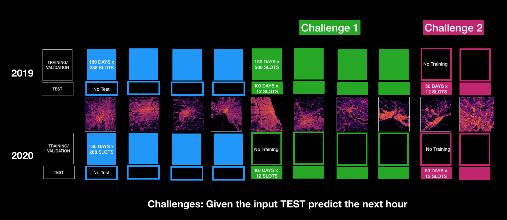

# Traffic4cast 2021 – Temporal and Spatial Few-Shot Transfer Learning in Traffic Map Movie Forecasting

- Study high-resolution 8-channel traffic movies of entire cities
- Overcome the temporal domain shift pre/post COVID-19
- Cover spatial domain shifts and predict traffic for unseen cities
- Incorporate road network information and detect patterns on graphs


[This repo](https://github.com/iarai/NeurIPS2021-traffic4cast) contains all information about the Traffic4cast 2021 NeurIPS competition for participants. It
contains detailed information about the competition and data as well as code.

## TLDR

After cloning this [repo](https://github.com/iarai/NeurIPS2021-traffic4cast.git), download [data](https://www.iarai.ac.at/traffic4cast/forums/forum/competition/competition-2021/) and extract data to `data/raw` subfolder, run

```bash
git clone https://github.com/iarai/NeurIPS2021-traffic4cast
cd NeurIPS2021-traffic4cast

conda env update -f environment.yaml
conda activate t4c

export PYTHONPATH="$PYTHONPATH:$PWD"
# run one of the following
# naive_average: take average of input frames as prediction for all prediction times
python baselines/baselines_cli.py --model_str=naive_average --limit=2 --epochs=1 --batch_size=1 --num_workers=1 --device=cpu
# a vanilla UNet:
python baselines/baselines_cli.py --model_str=unet          --limit=2 --epochs=1 --batch_size=1 --num_workers=1 --device=cpu
# gcn: graph-based model
python baselines/baselines_cli.py --model_str=gcn           --limit=2 --epochs=1 --batch_size=1 --num_workers=1 --train_fraction=0.97 --val_fraction=0.03  --file_filter="**/*BERLIN*8ch.h5" --device=cpu
```

This trains a vanilla U-Net / GCN on 1 training day of 1 city (240 samples) and creates a submission.

## Contents

[Traffic4cast 2021 – Temporal and Spatial Few-Shot Transfer Learning in Traffic Map Movie Forecasting](https://www.iarai.ac.at/traffic4cast):

- [Contents](#contents)
- [Introduction](#introduction)
- [Get the data](#get-the-data)
- [Getting started](#getting-started)
    - [Data](data/README.md)
    - [Metrics](metrics/README.md)
    - [Submission guide](util/README.md)
- [Explore with code](#explore-with-code)
- [Dev setup](#dev-setup)
- [Sitemap](#sitemap)
- [Cite](#cite)

## Introduction



Going beyond the challenges at NeurIPS 2019 and 2020, this year will explore models that adapt to domain shift both in space and time. Specifically, we will
provide dynamic traffic data for 4 different cities in the more effective format we introduced in Traffic4cast 2020. Half of this data will be from 2019, before
the COVID pandemic hit the world, and the other half will be from 2020 when the pandemic started affecting all our lives. We will complement these dynamic data
by static information on road geometry. We then provide two challenges to participants:

* In the **core challenge**, participants are tasked to handle **temporal domain shift** (an active field of machine learning research) in traffic due to
  COVID-19. In addition to the full data for the four cities described above, participants will receive pre-COVID data for four further cities, plus one hundred
  1h slots from 2020 after COVID struck. The challenge then is to predict the dynamic traffic states 5, 10, 15, 30, 45 and 60 minutes into the future after each
  of the one hundred time slots for each of the additional 4 cities.
* In an **extended challenge**, participants are asked to again predict dynamic traffic states for two further cities, **hitherto entirely unseen**. Like for
  the first challenge, traffic needs to be predicted 5, 10, 15, 30, 45 and 60 minutes into the future following 100 given 1h time slots. Yet there will be no
  further traffic data provided for these cities. Moreover, for each city, 50 of these 100 1h time slots will be from the period before COVID, and 50 from the
  period after COVID, without revealing which!

You can download the data once registered in the competition
-- [join and get the data](https://www.iarai.ac.at/traffic4cast/forums/forum/competition/competition-2021/)


## Submissions

You can submit your solutions once registered in the competition:

- Core Challenge  [Submit](https://www.iarai.ac.at/traffic4cast/competitions/t4c-2021-core-temporal/)
- Extended Challenge [Submit](https://www.iarai.ac.at/traffic4cast/competitions/t4c-2021-extended-spatiotemporal/)

## Getting started (longer version)

Find more detailed information to get started:

```
 + -- data/README.md       <-- data
 + -- metrics/README.md    <-- metric (mse)
```

We also refer to our [blog posts](https://www.iarai.ac.at/traffic4cast/forums/forum/competition/):
- [Competition Data Details](https://www.iarai.ac.at/traffic4cast/forums/topic/competition-data-details/)
- [Exploring the Temporal Shift from pre-COVID to in-COVID](https://www.iarai.ac.at/traffic4cast/forums/topic/exploring-the-temporal-shift-from-pre-covid-to-in-covid/)
- [Exploring the Spatial Data Properties](https://www.iarai.ac.at/traffic4cast/forums/topic/exploring-the-spatial-data-properties/)
- [Looking into data format](https://www.iarai.ac.at/traffic4cast/forums/topic/looking-into-data-format/)
- [Looking into the road graph](https://www.iarai.ac.at/traffic4cast/forums/topic/looking-into-the-road-graph/)


## Explore with code

In addition to `baselines/baselines_cli.py`, we provide the following Jupyter notebooks:

```
.
├── data
│   └── data_exploration.ipynb     <-- load and explore dynamic and static data
├── metrics
│   └── metrics.ipynb              <-- some insights with hard-coded baselines
└── competition
    └── competition.ipynb          <-- distribution of test slots
```

For the prerequisites, see `Dev setup` below.

## Dev Setup

### Conda environment

Create a conda environment using the provided conda environment file.

For GPU support, insert your CUDA version in `environment.yaml` before creating the environment.

```bash

conda env create -f environment.yaml
conda activate t4c
```

The project is not intended to be an installable pip package.

### Jupyter Notebooks

```
conda activate t4c
export PYTHONPATH="$PYTHONPATH:$PWD"
jupyter notebook
```
### Contribution conventions

Respect conventions although experimental code, run formatter and linter using `pre-commit` (https://pre-commit.com/), see
configuration `.pre-commit-config.yaml`:

```
pre-commit install # first time only
pre-commit run --all
git commit -am 'my message' --rebase

```

See https://blog.mphomphego.co.za/blog/2019/10/03/Why-you-need-to-stop-using-Git-Hooks.html

We use `numpy` docstring convention.

## Sitemap

```
.
├── baselines                   <-- trivial baselines and sample training pipelines
├── competition
│   ├── prepare_test_data       <-- create test manifests and package test data
│   ├── scorecomp               <-- competition scoring
│   ├── static_data_preparation <-- static data pipeline (relevant for participants only if they want to create their own static data)
│   └── submission              <-- create submissions
├── data
│   ├── compressed              <-- downloaded tarballs
│   ├── dataset                 <-- PyTorch dataset vanilla and torch_geometric
│   ├── processed               <-- processed graphs from `T4CGeometricDataset`
│   │   └── graphs
│   │       ├── ANTWERP
│   │       ├── ...
│   ├── raw                     <-- extracted tarballs
│   │   ├── ANTWERP
│   │   │   └── training
│   │   ├── ...
├── metrics                     <-- metrics and helpers
└── util                        <-- utility code for data reading/writing data
```

## Cite

When referencing the data or the models provided, please cite this paper:

*The manuscript is not ready yet. As soon as it is done, we will update this section and advertised it in the
[ News & Announcements forum](https://www.iarai.ac.at/traffic4cast/forums/forum/news-announcements/), please subscribe!*

```
@InProceedings{tbd}
```
