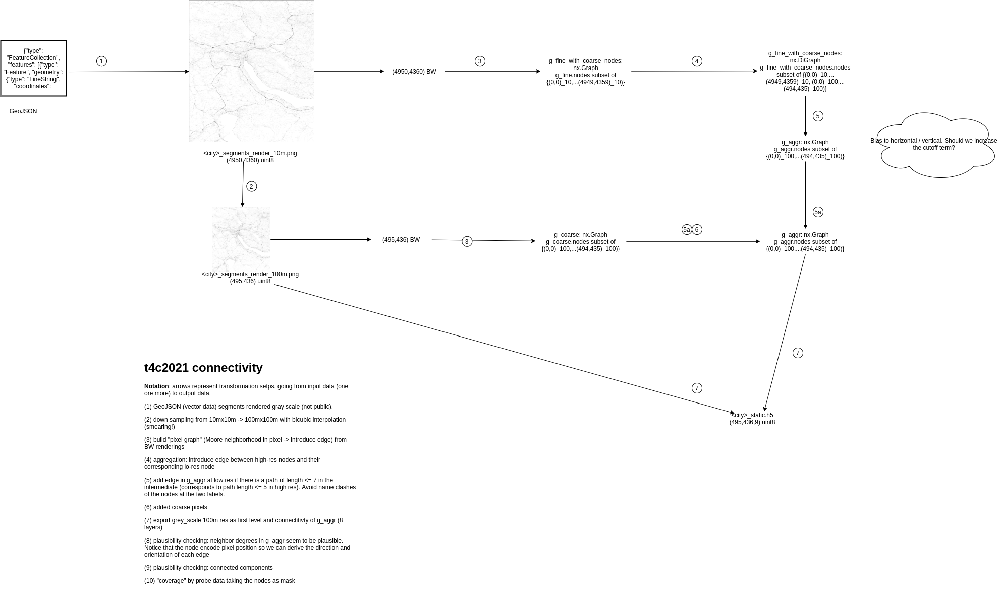

# Static Data Preparation

For an introduction, we refer to our blog post [Looking into the road graph](https://www.iarai.ac.at/traffic4cast/forums/topic/looking-into-the-road-graph/).

Here's a more detailed overview:
(Step (5) of the blog post is here divided into two steps (5) and (6))

